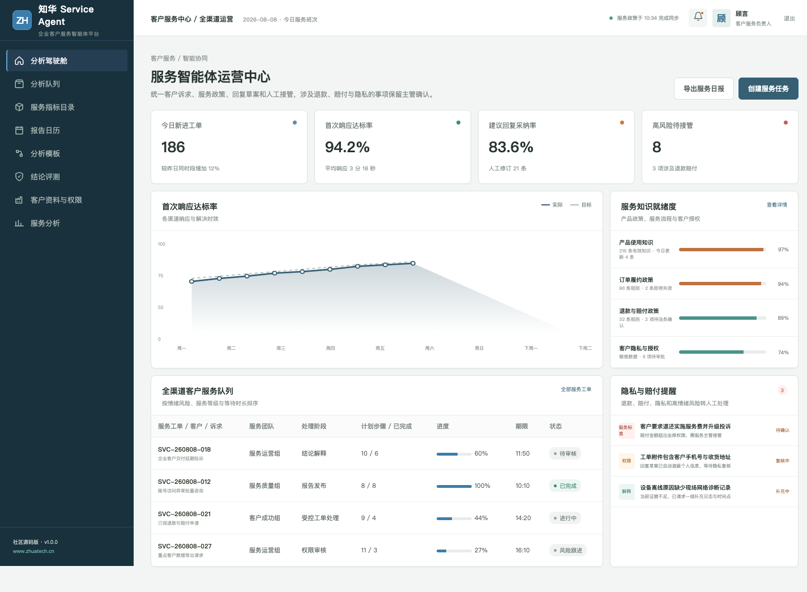
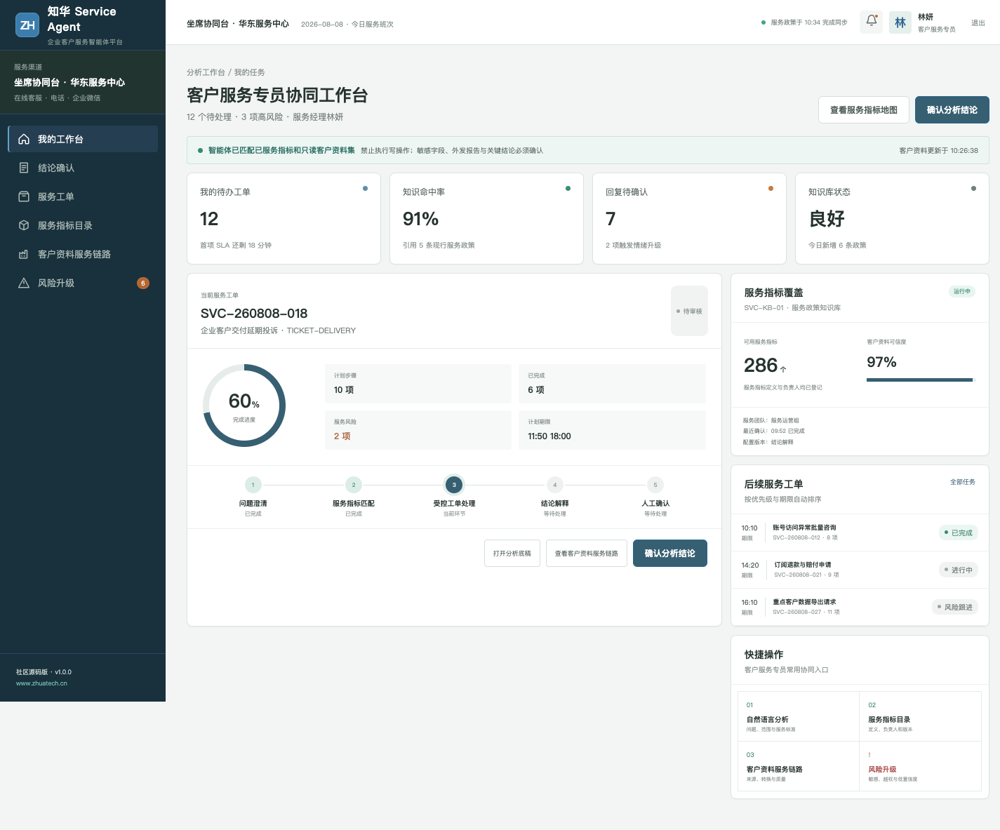

# ServiceAgent · 知华科技客户服务智能体

[知华科技官网](https://www.zhuatech.cn/) · 上海如静知华信息科技有限公司

ServiceAgent 不是一个“自动回复一切”的机器人，而是一套面向在线客服、电话客服、企业微信和客户成功团队的协同系统：智能体识别诉求、检索有效政策并起草回复；人工坐席负责沟通、承诺与结案。

## 从消息到结案

`客户消息 → 诉求与情绪识别 → 服务知识检索 → 回复草案 → 风险路由 → 人工确认 → 回访与评测`

运营中心展示全渠道工单、首次响应、知识就绪度、隐私风险、退款赔付及服务质量评测。

坐席端为一线服务人员保留引用依据、建议动作、客户上下文和人工接管入口，避免在高情绪场景继续机械回复。

## 社区版覆盖

- 多渠道服务工单与 SLA 队列
- 客户诉求、情绪和优先级辅助识别
- 产品政策、服务流程与历史案例引用
- 回复草案及敏感字段默认遮蔽
- 退款、赔付、投诉和隐私事项主管审批
- 回复评测、回访记录与知识缺口反馈

`CustomerResponseGuardService` 会根据情绪风险、隐私数据、退款赔付和主管审批状态，返回 `DRAFT_RESPONSE`、`HUMAN_TAKEOVER`、`PRIVACY_REVIEW` 或 `SUPERVISOR_APPROVAL` 等可解释路由。

## 技术栈与运行

- Java 21 / Spring Boot / Spring Security / JWT / JPA
- Vue 3 / Pinia / Vue Router / Vite / Axios
- MySQL 8 / Flyway / H2 Test
- Docker Compose / Nginx / GitHub Actions

~~~bash
cd frontend
npm install
npm run dev:demo
~~~

演示地址为 `http://localhost:5173`；`planner / Demo@2026` 进入管理端，`operator / Demo@2026` 进入坐席端。默认演示不发送真实消息，也不连接真实 CRM 或模型服务。

## 许可说明

本项目**仅能用于个人学习、研究和非商业交流，不得商用**。企业内部部署、生产使用、二次开发交付、SaaS、收费服务或品牌替换，需获得上海如静知华信息科技有限公司书面授权，完整条款见 [LICENSE](LICENSE)。

需要 AI 客服定制、知识库建设、系统集成、私有化部署或软件项目外包，可访问[知华科技官网](https://www.zhuatech.cn/)或扫码联系。

| 技术咨询 | 商务合作 |
| --- | --- |
|  |  |

SEO 关键词：Customer Service Agent、AI 客服系统、智能工单、客服知识库、人工接管、Java Vue 开源项目、知华科技。
